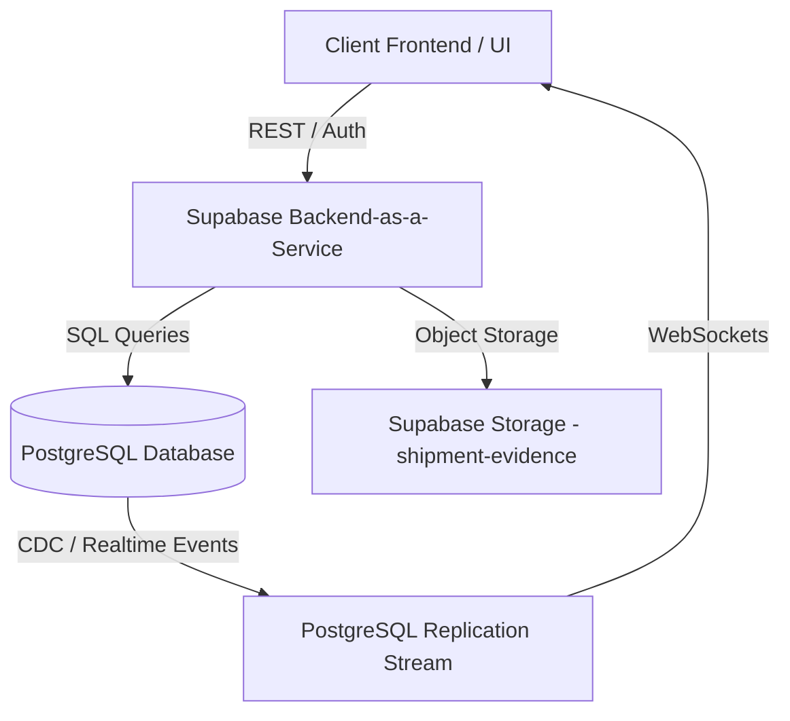

## Structured Project Specification

### 🔍 Architecture Overview
The system will transition to a Client-Server architecture utilizing a Backend-as-a-Service (BaaS) and modern UI utilities to support scalability, data persistence, and real-time communication.



---

### 🛠️ Technology Stack & External Libraries

| Category | Technology / Library | Description / Purpose |
| :--- | :--- | :--- |
| **Database** | Supabase (PostgreSQL) | Relational database hosting core tables & foreign key constraints. |
| **Realtime Sync** | PostgreSQL replication stream | Listens to `INSERT` events on the `messages` table for instant chat updates. |
| **File Storage** | Supabase Storage | Object storage bucket (`shipment-evidence`) for check-in images. |
| **Styling** | Tailwind CSS | Utility-first styling framework supporting dark/light utility modes. |
| **Icons** | Lucide Icons | Vector graphic library for clean, modern interface indicators. |
| **Feedback Alerts** | SweetAlert2 | Custom modal notifications for success/error popups. |

---

### 🗄️ Database Schema (PostgreSQL DDL)

#### 1. Users Table
Stores credentials and permissions.

```sql
CREATE TABLE users (
    id UUID PRIMARY KEY DEFAULT gen_random_uuid(),
    name VARCHAR(100) NOT NULL,
    role VARCHAR(20) CHECK (role IN ('manager', 'employee', 'customer')),
    email VARCHAR(255) UNIQUE NOT NULL,
    created_at TIMESTAMP WITH TIME ZONE DEFAULT TIMEZONE('utc', NOW())
);
```

#### 2. Shipments Table
Core entity tracking the package parameters.

```sql
CREATE TABLE shipments (
    id UUID PRIMARY KEY DEFAULT gen_random_uuid(),
    title VARCHAR(255) NOT NULL,
    customer_id UUID REFERENCES users(id) ON DELETE RESTRICT,
    employee_id UUID REFERENCES users(id) ON DELETE SET NULL,
    status VARCHAR(50) DEFAULT 'Pending Approval',
    goods_type VARCHAR(50) DEFAULT 'Standard',
    pickup_location VARCHAR(255) NOT NULL,
    final_destination VARCHAR(255) NOT NULL,
    created_at TIMESTAMP WITH TIME ZONE DEFAULT TIMEZONE('utc', NOW())
);
```

#### 3. Checkins Table (Timeline)
Records progress points along the route.

```sql
CREATE TABLE checkins (
    id UUID PRIMARY KEY DEFAULT gen_random_uuid(),
    shipment_id UUID REFERENCES shipments(id) ON DELETE CASCADE,
    location VARCHAR(255) NOT NULL,
    status VARCHAR(50) NOT NULL,
    note TEXT,
    photo_url TEXT, -- Public URL pointing to Supabase Storage Bucket
    is_final BOOLEAN DEFAULT FALSE,
    created_at TIMESTAMP WITH TIME ZONE DEFAULT TIMEZONE('utc', NOW())
);
```

#### 4. Messages Table
Stores chat history for internal/support channels.

```sql
CREATE TABLE messages (
    id UUID PRIMARY KEY DEFAULT gen_random_uuid(),
    shipment_id UUID REFERENCES shipments(id) ON DELETE CASCADE,
    sender_id UUID REFERENCES users(id) ON DELETE CASCADE,
    channel VARCHAR(20) CHECK (channel IN ('internal', 'client')),
    text TEXT NOT NULL,
    created_at TIMESTAMP WITH TIME ZONE DEFAULT TIMEZONE('utc', NOW())
);
```

---

### 🔄 Updated System Workflows

#### 1. Photo Upload Workflow

```text
[Employee Selects File] 
       │
       ▼
[Read file as Blob] 
       │
       ▼
[Upload to Supabase Storage Bucket: `shipment-evidence/s_id/c_id.png`] 
       │
       ▼
[Retrieve Public Signed URL] 
       │
       ▼
[Insert Checkin Row into DB containing `photo_url`]
```

#### 2. Real-Time Chat Update Workflow
Instead of polling the database or re-fetching on loops, client instances listen directly to changes using Supabase Realtime Channels:

```javascript
const messageSubscription = supabase
  .channel('public:messages')
  .on('postgres_changes', { event: 'INSERT', schema: 'public', table: 'messages' }, payload => {
      // Append the message to the screen if it belongs to the current active shipment
      appendMessageToDOM(payload.new);
  })
  .subscribe();
```

---

## 🛠️ Part 3: Conversion Log

Key formatting improvements applied during this database/UI revision:

* **Architecture Visualization:** Added a Mermaid architectural map to specify client-server relations.
* **Relational Integrity:** Designed SQL DDL schemas detailing keys (UUID, `FOREIGN KEY`) and schema rules.
* **Library Selection:** Structured external utilities into clear functional tables outlining their integration.
* **Code Standardizing:** Exchanged vanilla mock helpers with real initialization boilerplate (Supabase Web SDK).