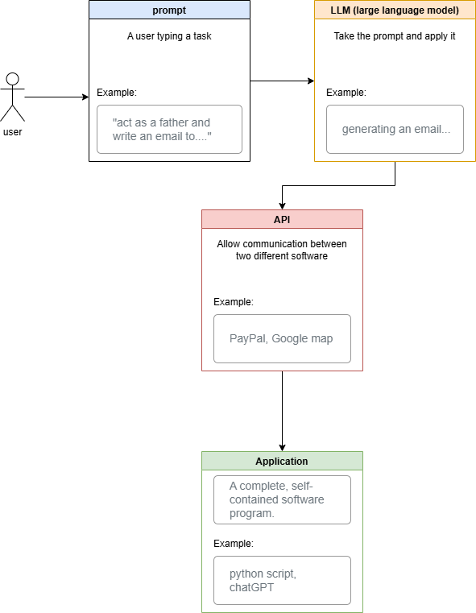

1-what is API? 
(Aplication programming interface)it allow communicate and share data between two different software 

2-What is a CLI?
(Command line interface) it is interface based on text allow the user to interace with the software and operating system by typing command

3-What is an IDE?
(Integrated Development Environment) software application that combines all essintial devolpment tools

